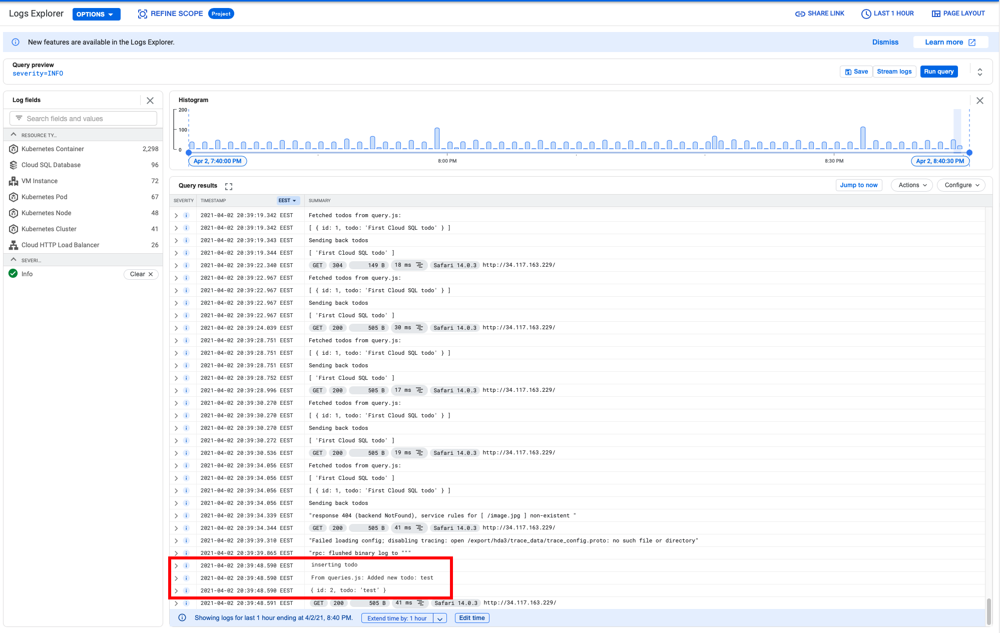
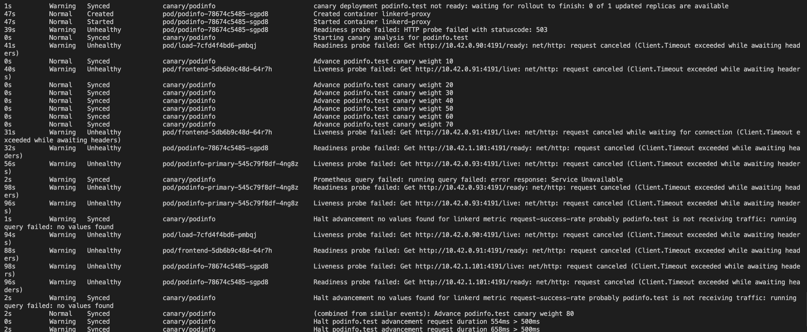

# DevOps with Kubernetes 2020-2021

This repository contains submissions for the course DevOps with Kubernetes 2020-2021. This document contains submissions for "written" exercises in the course.

# Exercise 3.06: DBaaS vs DIY

This comparison reflects the differences between using Google Cloud SQL for PostgreSQL versus using PersistentVolumeClaim with a self-hosted Postgres image, while letting GKE take care of PersistentVolume. However, the main ideas also applies for other methods as well.

## Initialisation

Setting up a database using DBaaS is very easy. For instance, initialising a MySQL instance on Cloud SQL is straightforward: set up an account, then create an instance from the Cloud SQL UI, then connect to it from the command line. From there, developers can create databases, users, add sample data, etc. Connecting instances to Google Kubernetes Engine is a bit more complex, but still straightforward due to the help of official guides. Newcomers will greatly appreciate the simplicity, which is even further clarified by the official documentation.

On the contrary, doing this step for a self-hosted solution is more cumbersome. Detailed configurations for the database needs to be specified, deployments and services have to be in place in order for the database to be accessible from other containers. This is certainly difficult and time-consuming for beginners who have little knowledge and experience, and might significantly delay the availability of the application. The upside is, however, if you are an experienced developer who knows what to do and what is needed, this method enables greater configurability and flexibility, as well as being less dependent on providers/vendors. 

## Maintenance

Google Cloud SQL provides extensive tools to monitor and manage database instances, all accessible from the console without any special configurations from the developers. Monitoring is easy given the charts and graphs provided on many different information. Regarding maintenance, developers and set maintenance windows, which allows Cloud SQL to fix bugs, prevent security exploits, apply updates, etc. This requires minimum input from the developers - all actual maintenance work is taken care of by Cloud SQL. 

Working with a self-hosted solution means that the developers have to self-configure monitoring tools. These tools can provide great insights into the database instances, but tends to require a lot more configuration compared to the already-provided solutions from DBaaS platforms. Maintaining and updating database instances is also more manual - the developers have to do it themselves, or have to set up a routine for it. More work, but once again, greater flexibility.   

## Backups

Google Cloud SQL, once again, illustrates the plug-and-play nature of DBaaS. Developers can easily set up a schedule for automatic backups, as well as create backups on demand whenever they want. The locations of backup storage, the frequency of automatic backups can be easily configured, and restoring to an earlier backup is also straightforward.

Configuring the same things on a self-hosted database is more difficult. For example, one has to deploy a CronJob that acts as the automatic backup agent (and that's the "easiest" option, other methods might require developers to write a lot more boilerplate code). Choosing backup locations is also completely up to developers. This creates more hassle, but of course provides more flexibility, and might enable developers to do more things with the backups than DBaaS services can provide.

## Ease of use

DBaaS is clearly easier to use than DIY solutions. It is recommended for beginners, or developers who want to focus on application development to first adopt these pre-made services that quickly allow applications to be deployed, then maybe switch to a self-hosted, more configurable solution when it is suitable to do so. In many cases, where for example the data must be stored in-house, or the database requires functionalities/properties not provided by DBaaS vendors, then self-hosted solutions are the way to go. Costs should also be taken into account based on the applications and databases usage.

## Pricing

Since Google Cloud SQL, as a DBaaS, takes care of initialising, managing, monitoring, maintaining, etc. our database instances for us, it is only fair that the costs of using it will be greater than hosting ourselves. The costs depend on how the instances are configured: the more resources they need, the more it costs. Cloud SQL gives us [some examples](https://cloud.google.com/sql/docs/postgres/pricing-examples): ranging from under $10 a month for a test instance to a couple thousands dollars for a high availability, high performance database.  

# Exercise 3.07: Commitment

I chose Google Cloud SQL, since I want to try something new (the application is already running with a PostgreSQL instance). The process turned out to have a bit more problems than I expected, but finally I got it running. 

# Exercise 3.10: Project v1.6

This is the screenshot where the logs (console.log from inside the services) are shown after a new todo is added.

# Exercise 5.02: Project: Service Mesh Edition
Calling linkerd inject alone does not seem to create the modified files, so instead I called `linkerd inject <OLDFILE> > <NEWFILE>` to get the modified files with annotations. The modified YAMLS are stored in the same folders as the old ones (todo-project/manifests)

# Exercise 5.03: Learn from external material
Here's the latter part of the output when `kubectl -n test get ev --watch`is called (the whole output is too long to be screnshotted, and to be honest I'm not sure what the task is saying when it reads "take a screenshot at the end", but I guess this is what it means?)

# Exercise 5.04: Platform comparison OpenShift vs Rancher
- Installation time: Rancher ranges from 20 minutes - 2 days, while OpenShift takes from 3 days to weeks
- Approach: OpenShift's approch is to create large k8s clusters and manage them independently, while Rancheräs is to unify clusters into one single management plane.
- Industry standards: OpenShift favors its own tools and pracrtices, which prevents developers from analysis paralysis, but creates vendor lock-in. In fact, switching back to vanilla Kubernetes is not possible once OpenShift is adopted. Rancher follows and extends industry standards, and just like Kubernetes, it does not tell you what to do, but rather gives you the tool to help you achieve what you need.
- From the point above, it leads to the fact that the skills you learnt from OpenShift might not be as transferrable as they can be from Rancher.
- Open source: while Rancher is 100% open-source, OpenShift has 2 versions: Community and Enterprise, the latter is not open source.

From this analysis I made, in my opinion Rancher is the better option. Easier installation and more freedom means more to me, even though OpenShift prevents me from having to consider a wide ranging set of options.

# Exercise 5.06: Landscape

- I used MongoDB in the past to build the databases for React applications
- I used MySQL in the pasting the process of learning SQL
- I used PostgreSQL to build and configure the database for the main application in this course
- I used redis to build the database for the todo project in this course
- I used NATS as a messaging system to enable a feature in the todo project, which broadcasts messages to my Telegram channel when a new todo is added, or modified.
- I used Helm to install Prometheus and Loki. 
- I used flux to configure CI/CD GitOps in my pingpong app.
- I used GitLab for university projects.
- I used Travis CI to configure CI/CD for one of my own projects
- I used Docker (obviously :D) to containerise applications
- I have some experience with Rancher during summer work, I used it but did not set it up or anything.
- I used AWS to host one of my projects. The specific services are AWS Lambda and S3.
- I used Google Kubernetes Engine to host a cluster in part 3 of this course
- I used Heroku to host another one of my projects.
- I used Kubernetes :D for this course
- I used Contour is configure the networking layer needed for Knative server less deployment in part 5.
- I used Linkerd as a service mesh to monitor my todo project in part 4.
- Flannel is indirectly used since k3d uses it. I didn’t actually know this until I read the task example answers :)
- I used Prometheus to monitor the cluster in part 2.
- I used Grafana to view the data monitored by Prometheus.
